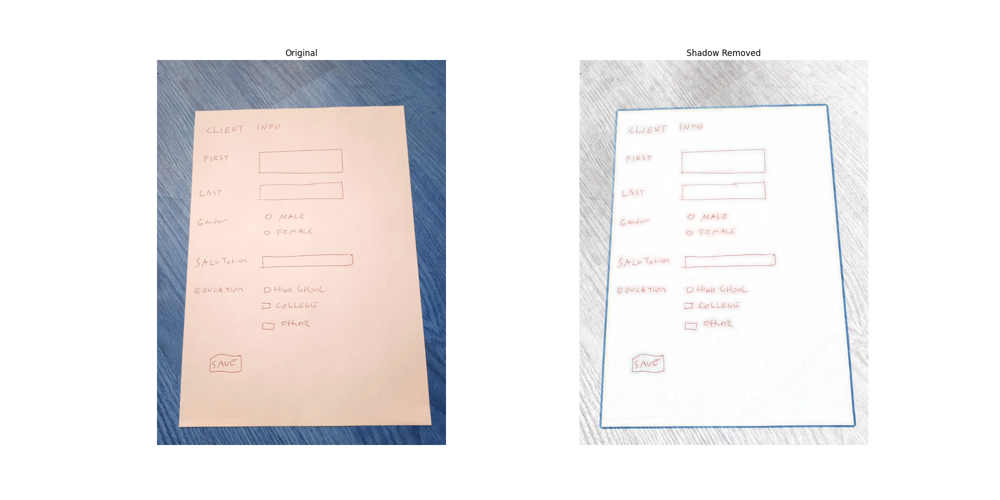
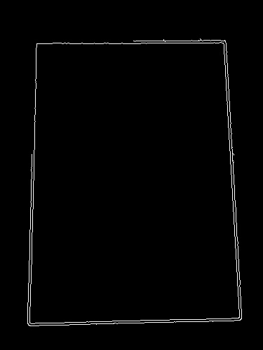
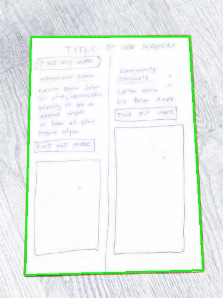
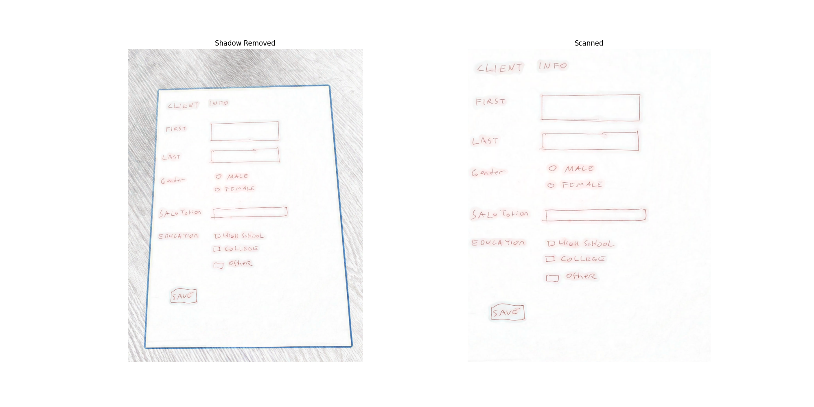
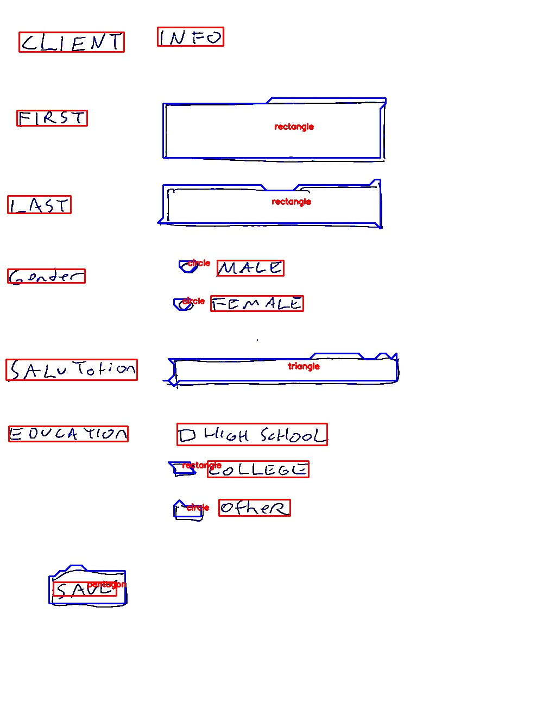

# Naive Document Recognition


## Preprocessing

<br>

1. Shadow Removal 


    ```python
    def shadow_remove(img):
    rgb_planes = cv2.split(img)
    result_norm_planes = []
    for plane in rgb_planes:
        dilated_img = cv2.dilate(plane, np.ones((7,7), np.uint8))
        bg_img = cv2.medianBlur(dilated_img, 21)
        diff_img = 255 - cv2.absdiff(plane, bg_img)
        norm_img = cv2.normalize(diff_img,None, alpha=0, beta=255, norm_type=cv2.NORM_MINMAX, dtype=cv2.CV_8UC1)
        result_norm_planes.append(norm_img)
    shadowremov = cv2.merge(result_norm_planes)
    return shadowremov
    ```

    

2. Homography Transformation

    1. Edge Detection

        ```python

        # A code block from shape-detection.ipynb 
        # Preprocessing.scan_image()

        ratio = image.shape[0] / 500.0
        orig = image.copy()
        image = imutils.resize(image, height = 500)
        
        gray = cv2.cvtColor(image, cv2.COLOR_BGR2GRAY)
        gray = cv2.GaussianBlur(gray, (5, 5), 0)
        edged = cv2.Canny(gray, 100, 255)
        ```

        <br>

        

    2. Finding Contours

       

        ```python

        # A code block from shape-detection.ipynb 
        # Preprocessing.scan_image()

        cnts = cv2.findContours(edged.copy(), cv2.RETR_LIST, cv2.CHAIN_APPROX_SIMPLE)

            cnts = imutils.grab_contours(cnts)
            cnts = sorted(cnts, key = cv2.contourArea, reverse = True)[:5]
        

            for c in cnts:
                # approximate the contour
                peri = cv2.arcLength(c, True)
                approx = cv2.approxPolyDP(c, 0.02 * peri, True)
                # if our approximated contour has four points, then we
                # can assume that we have found our screen
                
                if len(approx) == 4:
                    screenCnt = approx
                    break
            # show the contour (outline) of the piece of paper
            cv2.drawContours(image, [screenCnt], -1, (0, 255, 0), 2)

            
        ```

         <br>

        


    3. Four point transform

        ```python

        # A code block from shape-detection.ipynb 
        # Preprocessing.scan_image()

         warped = self.four_point_transform(orig, screenCnt.reshape(4, 2) * ratio)
         warped = warped[20:-20,20:-20]
        ```

    

    <br>

    


## Shape Detection

```python

# A code block from shape-detection.ipynb 
# ShapeDetector.detect_shapes()

for c in cnts:

    if cv2.contourArea(c) < 4:
        continue
    
    M = cv2.moments(c)
    if M["m00"] > 0:
        cX = int((M["m10"] / M["m00"]) * ratio)
        cY = int((M["m01"] / M["m00"]) * ratio)
        shape = self.predict_shape(c)
        c = c.astype("float")
        c *= ratio
        c = c.astype("int")

        cv2.drawContours(image_copy, [c], -1, (255, 0, 0), 2)
        cv2.putText(image_copy, shape, (cX, cY), cv2.FONT_HERSHEY_SIMPLEX,
            0.5, (0, 0, 255), 2)

            ...

```


```python

def predict_shape(self, c):
    shape = "unidentified"
    peri = cv2.arcLength(c, True)
    approx = cv2.approxPolyDP(c, 0.04 * peri, True)
  
    if len(approx) == 3:
        shape = "triangle"
   
    elif len(approx) == 4:
        
        (x, y, w, h) = cv2.boundingRect(approx)
        ar = w / float(h)

        shape = "square" if ar >= 0.95 and ar <= 1.05 else "rectangle"
   
    elif len(approx) == 5:
        shape = "pentagon"
    else:
        shape = "circle"

    return shape
```

<br>



---

```python

def reject_outliers(data, m=1):
    filtered_contours= []
    contour_areas = [cv2.contourArea(i) for i in data]
    for i in data:
        contour_area = cv2.contourArea(i)
        if abs(contour_area - np.mean(contour_areas)) > m * np.std(contour_areas):
            filtered_contours.append(i)
    return filtered_contours
```
---
License: MIT License


>**Important Note:** To use the "craft_hw_ocr==1.1" library, you must downgrade to "torchvision==0.12.0" and "numpy==1.21.6" versions and use "python 3.9.0"

---
