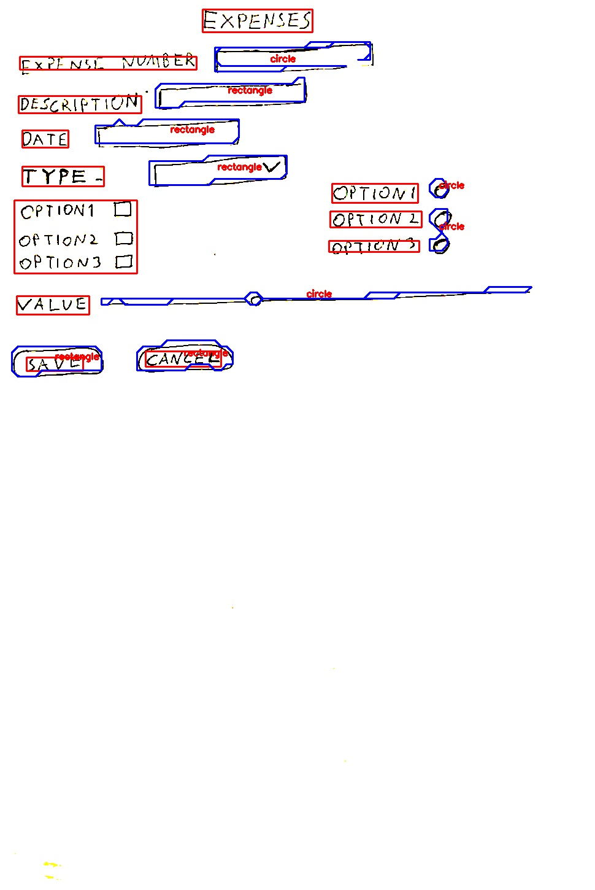
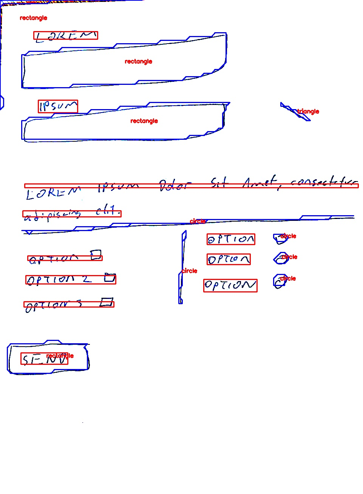
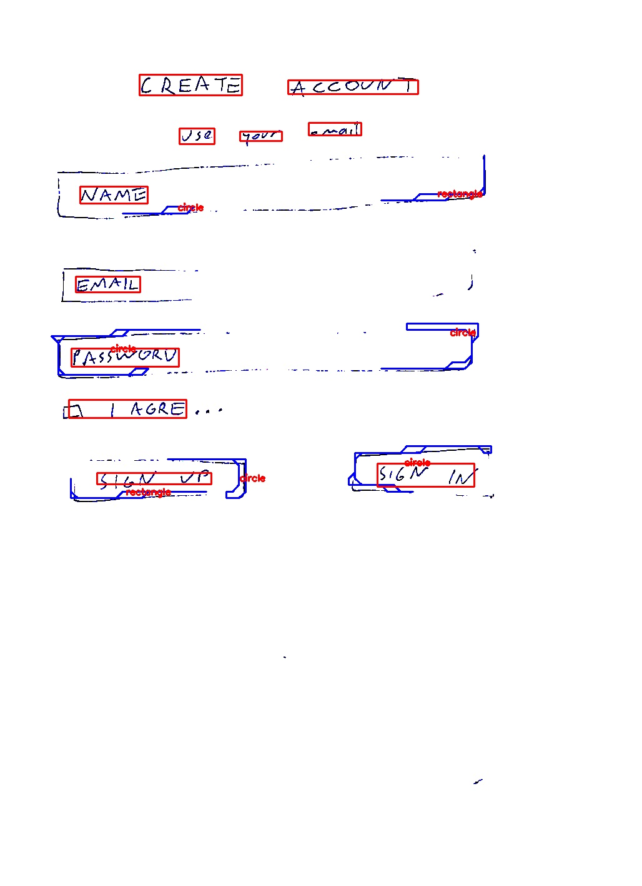

# Low Code - Hand-Drawn Sketch Recognition

<br>

## İçindekiler

<br>

* [Projenin Amacı](#projenin-amacı)
* [Preprocessing](#preprocessing)
* [Text Detection & OCR](#text-detection--ocr)
* [Shape Detection](#shape-detection)
* [Bulgular](#bulgular)

<br>

## Projenin Amacı

<br>

Elle çizilmiş belgelerden uygulama oluşturma yeteneği, geliştiricilere yardımcı olacak yenilikçi bir özelliktir.

Geliştirilmek istenen aplikayonun form ekranlarını tasarım dosyalarından ve görüntülerden analiz ederek, formdaki metin etiketlerini ve metin girişi kontrollerini tanıyan ve bunları otomatik olarak oluşturarak uygulamaların daha hızlı ve kolay oluşturalabilmesini sağlayan bir eklenti olarak, low code platformlarına entegre edilmesi hedeflenmiştir.

Low/No Code geliştirme platformları, geliştiricilerin uygulama bileşenlerini sürükleyip bırakmasına, bunları birbirine bağlamasına ve mobil veya web uygulamaları oluşturmasına olanak tanıyan görsel yazılım geliştirme ortamlarıdır.

<br>

---

## Preprocessing

<br>

1. Shadow Removal [ref.][4]

    Aşağıdaki kod bloğunda OpenCV fonksiyonları kullanılarak görüntü üzerindeki gölgelerin kaldırılması sağlanır ve böylelikle görsel üzerindeki gürültü azaltılır.

    ```python
    def shadow_remove(img):
    rgb_planes = cv2.split(img)
    result_norm_planes = []
    for plane in rgb_planes:
        dilated_img = cv2.dilate(plane, np.ones((7,7), np.uint8))
        bg_img = cv2.medianBlur(dilated_img, 21)
        diff_img = 255 - cv2.absdiff(plane, bg_img)
        norm_img = cv2.normalize(diff_img,None, alpha=0, beta=255, norm_type=cv2.NORM_MINMAX, dtype=cv2.CV_8UC1)
        result_norm_planes.append(norm_img)
    shadowremov = cv2.merge(result_norm_planes)
    return shadowremov
    ```

    1. dilation  <br>
    Bu operatör giriş olarak verilen görüntü üzerinde parametreler ile verilen alan içerisindeki sınırları genişletmektedir, bu genişletme sayesinde görüntüdeki parlak bölgeler büyür ve piksel grupları arası boşluklar küçülür.
    2. mediunblur <br>
    Ortanca filtreyi kullanarak görüntüyü bulanıklaştırır.
    3. absdiff <br>
    İki dizi arasındaki veya bir dizi ile bir skaler arasındaki öğe başına mutlak farkı hesaplar. Burada resmin pixel değerlerinin tersinin alınması için kullanılmıştır.
    4. normalize <br>
        Bir dizinin normunu veya değer aralığını normalleştirir.

    <br>

    

2. Image Scanning [ref.][5]

    1. Kenar algılama

        ```python

        # A code block from shape-detection.ipynb 
        # Preprocessing.scan_image()

        ratio = image.shape[0] / 500.0
        orig = image.copy()
        image = imutils.resize(image, height = 500)
        
        gray = cv2.cvtColor(image, cv2.COLOR_BGR2GRAY)
        gray = cv2.GaussianBlur(gray, (5, 5), 0)
        edged = cv2.Canny(gray, 100, 255)
        ```

        * Görüntü işlemeyi hızlandırmak ve kenar algılama adımımızı daha doğru hale getirmek için, taranan görüntümüzü 500 piksel yüksekliğe sahip olacak şekilde yeniden boyutlandırıyoruz.
        * Ayrıca görüntünün orijinal yüksekliğinin yeni yüksekliğe oranını takip etmeye özel özen gösteriyoruz — bu, taramayı yeniden boyutlandırılmış görüntü yerine orijinal görüntü üzerinde gerçekleştirmemizi sağlayacaktır.
        * Oradan, görüntüyü RGB'den gri tonlamaya dönüştürüyoruz, yüksek frekanslı gürültüyü gidermek için Gauss bulanıklaştırma yapıyoruz

        <br>

        

    2. Taranan kağıt parçasını temsil eden konturu bulmak için görüntüdeki kenarların kullanılması.

        >Konturlar, aynı renk veya yoğunluğa sahip tüm sürekli noktaları (sınır boyunca) birleştiren bir eğri olarak basitçe açıklanabilir. Konturlar, şekil analizi ve nesne algılama ve tanıma için yararlı bir araçtır.


        * Görüntüdeki tam olarak dört noktalı en büyük konturun taranacak kağıt parçamız olduğunu varsayacağız.

        * Tarayıcı uygulamamız, taramak istediğiniz belgenin görüntümüzün ana odağı olduğunu ve kağıt parçasının dört kenarı olduğunu varsayar.

        ```python

        # A code block from shape-detection.ipynb 
        # Preprocessing.scan_image()

        cnts = cv2.findContours(edged.copy(), cv2.RETR_LIST, cv2.CHAIN_APPROX_SIMPLE)

            cnts = imutils.grab_contours(cnts)
            cnts = sorted(cnts, key = cv2.contourArea, reverse = True)[:5]
        

            for c in cnts:
                # approximate the contour
                peri = cv2.arcLength(c, True)
                approx = cv2.approxPolyDP(c, 0.02 * peri, True)
                # if our approximated contour has four points, then we
                # can assume that we have found our screen
                
                if len(approx) == 4:
                    screenCnt = approx
                    break
            # show the contour (outline) of the piece of paper
            cv2.drawContours(image, [screenCnt], -1, (0, 255, 0), 2)

            
        ```

         <br>

        


    3. Belgenin yukarıdan aşağıya görünümünü elde etmek için bir perspektif dönüşümün uygulanması.

        ```python

        # A code block from shape-detection.ipynb 
        # Preprocessing.scan_image()

         warped = self.four_point_transform(orig, screenCnt.reshape(4, 2) * ratio)
         warped = warped[20:-20,20:-20]
        ```

        * Belgenin ana hatlarını temsil eden dört noktayı almak ve görüntünün yukarıdan aşağıya, "kuşbakışı" bir görünümünü elde etmek için bir perspektif dönüşümü uygulanır.
        * Son olarak dönüştürülen görüntüdeki kenarların sonraki adımda kontur olarak algılanmasından kaçınmak için kenarların küçük bir kısmı kırpılır.

    <br>

    

---

## Text Detection & OCR

Projede metin tanıma ve ocr işlemleri için [craft_hw_ocr][1] kütüphanesi kullanılmaktadır. Bu kütüphane [CRAFT][2] ve [TrOCR][3] modellerinin kullanarak el yazısı metinlerinin tanınması için geliştirilmiştir.

### Text Detection

*CRAFT (Character Region Awareness for Text Detection)*, metnin etrafındaki bölgeyi keşfederek görüntüler üzerinde OCR yapmanın bir yoludur. Yüksek düzeyde, algoritma görüntünün ısı haritasını oluşturur ve doğrudan görüntü yerine bunların üzerinde evrişime uğrar.


### OCR

*TrOCR*, esas olarak bir encoder-decoder modelidir; burada kodlayıcı ağı, görüntü kodlama dönüştürücü modelleri (ViT, DEiT) kullanarak görüntünün bir temsilini oluşturur ve kod çözücü ağı (dil modelleri), işlenmiş temsili hedef dizilere dönüştürür.

>**Önemli Not:** "craft_hw_ocr==1.1" kütüphanesinin kulllanılması için "torchvision==0.12.0" ve "numpy==1.21.6" versiyonlarına downgrade edilmeli ve "python 3.9.0" kullanılmalıdır

---

## Shape Detection

<br>

### Metodoloji [ref.][6]

<br>

Belirli bir çokgenin şeklini tespit etmek için kullanacağımız yaklaşım, tespit edilen şekli sahip olduğu kenar sayısına göre sınıflandırmaya dayalı olacaktır. Örneğin, tespit edilen polinomun 3 kenarı varsa, o zaman bir üçgen olarak kabul edilebilir, polinomun 4 kenarı varsa, o zaman bir kare veya bir dikdörtgen olarak sınıflandırılabilir.

```python

# A code block from shape-detection.ipynb 
# ShapeDetector.detect_shapes()

bboxes, img_text_cleared, texts = self.OCR(image)
for i in bboxes.astype('int32'):
    cv2.fillPoly(img_text_cleared, pts=[i], color=(255,255,255))
```

Daha sonra görüntüde şekilleri belirginleştirmek için ikili renk uzayına geçtikten sonra adaptive_threshold uyguluyoruz.

 >Eşikleme (Thresholding), sağlanan eşik değerine göre piksel değerlerinin atanması olan OpenCV'de bir tekniktir. Eşiklemede, her bir piksel değeri, eşik değeri ile karşılaştırılır. Piksel değeri eşikten küçükse 0'a, aksi takdirde maksimum bir değere (genellikle 255) ayarlanır.

 Bulunan konturlar teker teker dolaşılır ve her konturun kenar sayısına göre polinom adının yazdırılması için <code>cv2.approxPolyDP()</code> fonksiyonu kullanılır

```python

T = threshold_local(img_text_cleared, 27, offset = 17, method = "gaussian")
img_text_cleared = (img_text_cleared > T).astype("uint8") * 255

resized = imutils.resize(img_text_cleared, width=100)
ratio = img_text_cleared.shape[0] / float(resized.shape[0])
gray = cv2.cvtColor(resized, cv2.COLOR_BGR2GRAY)

thresh = cv2.bitwise_not(gray)
cnts = cv2.findContours(thresh.copy(), cv2.RETR_EXTERNAL,
    cv2.CHAIN_APPROX_SIMPLE)
cnts = imutils.grab_contours(cnts)

```
<code>cv2.findContours()</code> fonksiyonu siyah arka plan üzerindeki beyaz şekilleri algılamaktadır bu yüzden <code>cv2.bitwise_not()</code> fonksiyonu kullanılarak görüntünün piksel değerleri ters çevrilir.

Bulunan konturlar bir döngü içinde teker teker ele alınır. Bu aşamada istenmeyen konturlar filtrelenebilir.

```python

# A code block from shape-detection.ipynb 
# ShapeDetector.detect_shapes()

for c in cnts:

    if cv2.contourArea(c) < 4:
        continue
    
    M = cv2.moments(c)
    if M["m00"] > 0:
        cX = int((M["m10"] / M["m00"]) * ratio)
        cY = int((M["m01"] / M["m00"]) * ratio)
        shape = self.predict_shape(c)
        c = c.astype("float")
        c *= ratio
        c = c.astype("int")

        cv2.drawContours(image_copy, [c], -1, (255, 0, 0), 2)
        cv2.putText(image_copy, shape, (cX, cY), cv2.FONT_HERSHEY_SIMPLEX,
            0.5, (0, 0, 255), 2)

            ...

```

Örnek olarak görüntüdeki gürültü yüzünden çok sayıda istenmeyen kontur oluşabilir bu konturlar boyutlarına göre veya [kontur özelliklerine][7] göre filtrelenebilir.

Aşağıda köşe sayılarına göre hangi şekil olduğunu tahmin eden fonksiyon verilmiştir.

```python

def predict_shape(self, c):
    shape = "unidentified"
    peri = cv2.arcLength(c, True)
    approx = cv2.approxPolyDP(c, 0.04 * peri, True)
  
    if len(approx) == 3:
        shape = "triangle"
   
    elif len(approx) == 4:
        
        (x, y, w, h) = cv2.boundingRect(approx)
        ar = w / float(h)

        shape = "square" if ar >= 0.95 and ar <= 1.05 else "rectangle"
   
    elif len(approx) == 5:
        shape = "pentagon"
    else:
        shape = "circle"

    return shape
```

Son olarak bulunan şekillerin konturları ve etiketleri orjinal resmin kopyasına yazdırılarak aşağıdaki çıktıyı verir.

<br>


---

### Bulgular

>Problem: <code>threshold_local()</code> fonksiyonu uygulandıktan sonra text-detection modeli ayrı metin bölgelerini birleştirerek daha kötü performans göstermektedir.



>Problem: <code>cv2.findContours() </code> fonksiyonuyla elde edilen metin konturları shape-detection algortiması tarafından tanınmamaktadır. Bu sorunun çözümü için ilk önce text detection algoritması çalıştırılır ve görsel üzerindeki metin bölgeleri bulunduktan sonra beyaz pixellerle doldurulur.
Bu yöntemin beraberinde getirdiği bir sorun ise metin tanıma algoritmasının düzgün çalışmadığı durumlarda, örneğin checkbox kutusunun "D" harfi olarak algılandığı bir durumda, o bölge beyaz piksellerle maskelendiği için shape-detection algoritması tarafından tespit edilememektedir.



>Problem: Silik çizilmiş eskiz örneklerinde uygulama verimsiz çalışmaktadır. Kesik çizgileri birleştiren bir önişleme adımı eklenmelidir.



>Problem: Düz çizgilerin tespit edilmesinin engellenmesi için bir filtre algoritması yazılmalıdır


>Deneme: Aşağıdaki kod parçasında konturlar aykırı değerlerine göre filtrelenmesi denenmiş fakat tespit edilmesi gereken konturları da elediği için istenilen şekilde çalışmamaktadır.

```python

def reject_outliers(data, m=1):
    filtered_contours= []
    contour_areas = [cv2.contourArea(i) for i in data]
    for i in data:
        contour_area = cv2.contourArea(i)
        if abs(contour_area - np.mean(contour_areas)) > m * np.std(contour_areas):
            filtered_contours.append(i)
    return filtered_contours
```

[1]: <https://github.com/Vishnunkumar/craft_hw_ocr> "craft_hw_ocr"
[2]: <https://github.com/clovaai/CRAFT-pytorch/> "CRAFT"
[3]: <https://huggingface.co/docs/transformers/model_doc/trocr/> "trocr"
[4]: <https://medium.com/arnekt-ai/shadow-removal-with-open-cv-71e030eadaf5> "Shadow Removal Referance"
[5]: <https://pyimagesearch.com/2014/09/01/build-kick-ass-mobile-document-scanner-just-5-minutes/> "Image Scanning Referance"
[6]: <https://medium.com/simply-dev/detecting-geometrical-shapes-in-an-image-using-opencv-bad67c40174f> "Object Detection Referance"
[7]: <https://docs.opencv.org/3.4/d1/d32/tutorial_py_contour_properties.html> "Contour Properties"